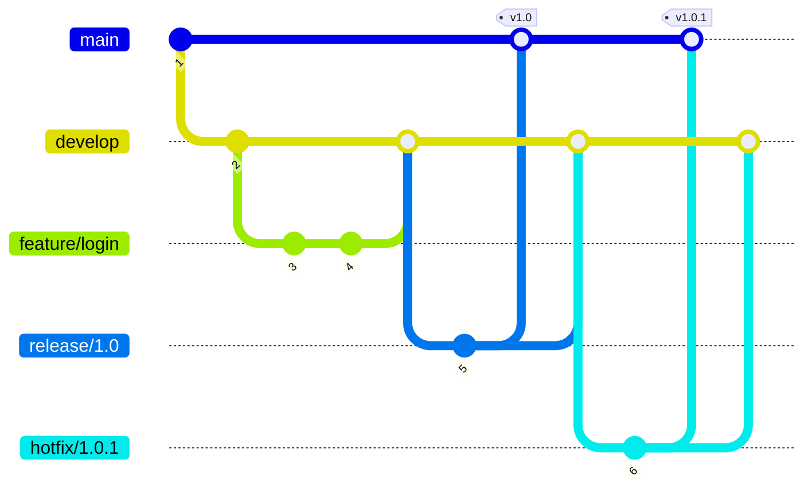

# Dominando GitFlow
### Un vistazo rápido al flujo de trabajo más sólido de Git

  <a href="https://nvie.com/posts/a-successful-git-branching-model/" target="_blank" 
    class="text-xl opacity-50 !border-none !hover:text-white">
    <carbon-document-view />
  </a>

---
layout: intro
---

# ¿Por qué GitFlow? (y para quién)

  
🎯

  <h3>Organización</h3>
  
Organización clara de ramas

  
🤝

  <h3>Colaboración</h3>
  
Trabajo en equipo sin pisarnos

  
🚀

  <h3>Control</h3>
  
Control estricto de releases y hotfixes

  
👥

  <h3>Ideal para</h3>
  
Equipos medianos/grandes con releases periódicas

---
layout: two-cols
---

# Estructura y Flujo

  <h3 class="text-blue-500">🔷 master</h3>
  
Rama estable en producción

  <h3 class="text-green-500">🔷 develop</h3>
  
Integración de features

  <h3 class="text-purple-500">🔷 feature/*</h3>
  
Nuevas funcionalidades (a partir de develop)

::right::

  <h3 class="text-yellow-500">🔷 release/*</h3>
  
Preparar versión final (se fusiona en master + develop)

  <h3 class="text-red-500">🔷 hotfix/*</h3>
  
Parche urgente en producción (desde master)

---
layout: center
---

# Flujo General

---
layout: default
---

# Pros / Contras & Alternativas

  <h3 class="text-xl font-bold text-green-700 mb-4">✅ Pros</h3>
  <ul class="space-y-2 text-gray-700">
    <li>Estructura muy clara</li>
    <li>Facilita releases y hotfixes</li>
  </ul>

  <h3 class="text-xl font-bold text-red-700 mb-4">❌ Contras</h3>
  <ul class="space-y-2 text-gray-700">
    <li>Excesivo en proyectos simples</li>
    <li>Más ramas = más merges</li>
  </ul>

  <h3 class="text-xl font-bold text-blue-700 mb-4">🔄 Alternativas</h3>
  <ul class="space-y-2 text-gray-700">
    <li>GitHub Flow: Más simple</li>
    <li>GitLab Flow: Más flexible</li>
  </ul>

---
layout: end
---

# Conclusión

  
✨ GitFlow = orden y seguridad en el desarrollo

  
🎯 Ideal para equipos con lanzamientos regulares

  
⚠️ Evitar para proyectos muy pequeños

  <a href="https://danielkummer.github.io/git-flow-cheatsheet/" target="_blank" class="text-blue-500">
    📚 GitFlow Cheatsheet
  </a>

  ¡Gracias!

